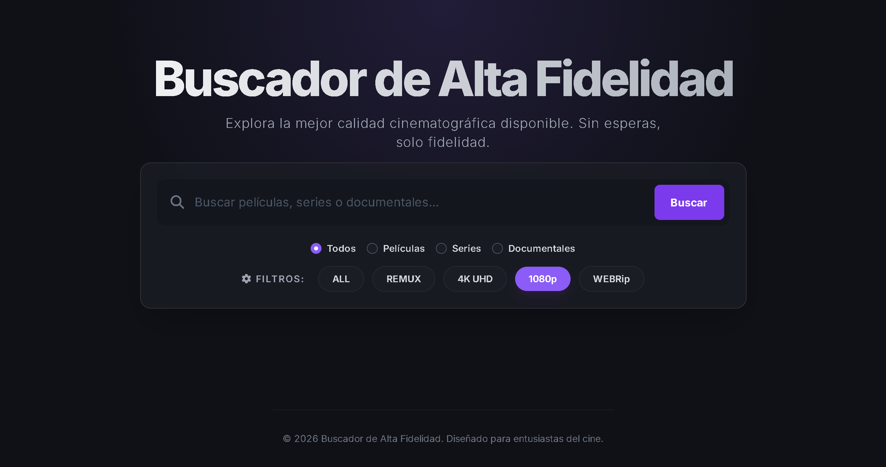

# Media Tracker - Buscador de Alta Fidelidad

Una aplicación web ultrarrápida y estéticamente premium diseñada para entusiastas del cine y las series. Funciona como un metabuscador que se conecta a tu instancia local de [Jackett](https://github.com/Jackett/Jackett) para rastrear y filtrar enlaces Torrent (Películas, Series y Documentales) ofreciendo los resultados de manera unificada, inteligente y visualmente atractiva con integración a TMDB.

## ✨ Características Principales

- **Filtros Avanzados**: Búsqueda exclusiva por categorías (Películas, Series, Documentales o Todos) y filtro visual rápido por calidad gráfica (1080p, 4K UHD, REMUX, WEBRip).
- **Agrupación Inteligente**: En lugar de mostrar cientos de torrents desordenados, la aplicación (gracias a `parse-torrent-title`) agrupa todas las variantes de una misma obra bajo una única tarjeta expandible.
- **Integración con TMDB**: Automáticamente obtiene el póster oficial, año de lanzamiento y sinopsis en español de la base de datos de TMDB para presentar las obras.
- **Temporadas Completas Destacadas**: Detección automática de "Pack de Series" o temporandas enteras (`is_full_season`). Estos resultados se fijan a la parte superior de cada grupo con una insignia dorada.
- **Copiar Magnet con un Clic**: Interfaz sin fricciones. Un solo botón para abrir el Torrent o un botón dedicado para copiar el Magnet al portapapeles y pasarlo por WhatsApp/Telegram.
- **Soporte FlareSolverr Multiplicado**: Totalmente compatible con indexadores pesados (como 1337x) que requieren bypass de Cloudflare (los timeouts de conexión están ajustados tolerar las demoras sin problemas).
- **Indicadores de Idioma**: Detección inteligente si el archivo contiene audio "Latino", "Castellano" o "Subtitulado".

## 🚀 Requisitos

Necesitarás tener instalado y corriendo en tu equipo local:

- Python 3.10 o superior.
- [Jackett](https://github.com/Jackett/Jackett) (Corriendo por defecto en el puerto `9117`).
- _(Opcional pero Recomendado)_ [FlareSolverr](https://github.com/FlareSolverr/FlareSolverr) para acceder a indexadores protegidos por Cloudflare como 1337x.

## 🛠 Instalación y Uso

1. **Clonar este repositorio:**

   ```bash
   git clone https://github.com/tu-usuario/rastreador-de-torrents.git
   cd rastreador-de-torrents
   ```

2. **Crear y activar un entorno virtual (opcional pero recomendado):**

   ```bash
   python -m venv venv
   # En Windows:
   venv\Scripts\activate
   ```

3. **Instalar dependencias:**

   ```bash
   pip install -r requirements.txt
   ```

4. **Configurar Variables de Entorno:**
   Renombra el archivo `.env.example` a `.env` (si existe, o simplemente crea `.env`) en la carpeta raíz, e ingresa tus credenciales:

   ```env
   # URL de Jackett. Cambiar solo si no corre en local.
   JACKETT_URL=http://localhost:9117

   # Tu llave de API de Jackett (Puedes verla en la web de Jackett arriba a la derecha).
   JACKETT_API_KEY=tu_api_key_de_jackett

   # [Opcional] API Key de The Movie Database para obtener Posteres. Obtener en: https://www.themoviedb.org/settings/api
   TMDB_API_KEY=tu_api_key_de_tmdb_aca
   ```

5. **Ajustes Adicionales de Jackett (Recomendado):**
   - Asegúrate de subir el valor de **Timeout** genérico en la configuración de Jackett si empleas _FlareSolverr_ (ejemplo a `150` o `55000` ms).

6. **Ejecutar el Servidor Web:**

   ```bash
   python app.py
   ```

7. **A disfrutar:** ¡Abre tu navegador web y visita [http://localhost:5000](http://localhost:5000)!

## 📸 Capturas de Pantalla



---

_Hecho para amantes del cine. Ningún Torrent está hosteado en este proyecto, solo se conectan APIs bajo la responsabilidad del usuario._
